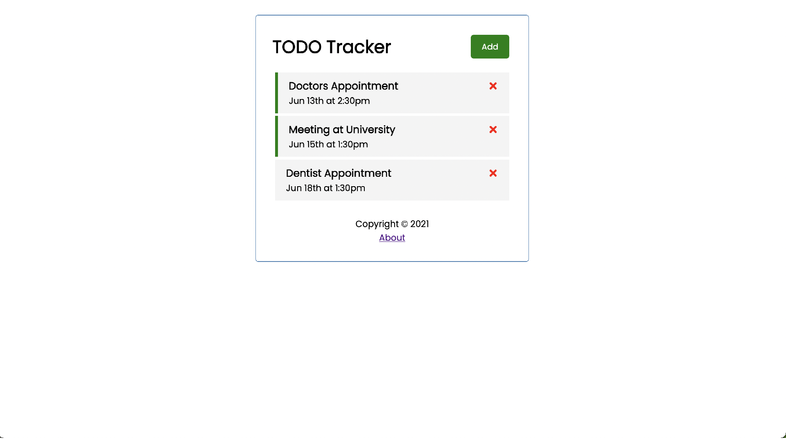
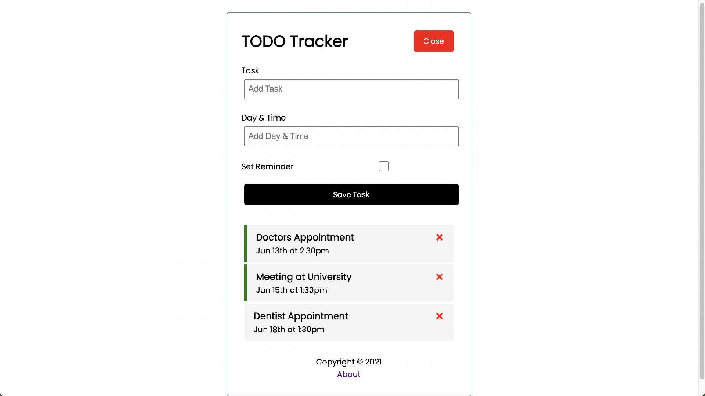

# React-TODO-app
TODO application in react


### Install dependencies

```
npm install
```

### Run React dev server (http://localhost:3000)

```
npm start
```

### Run the JSON server (http://localhost:5000)

```
npm run server
```

### To build for production

```
npm run build
```

### Images



